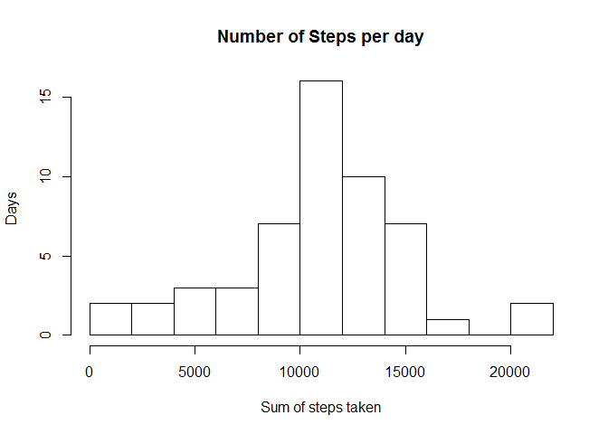
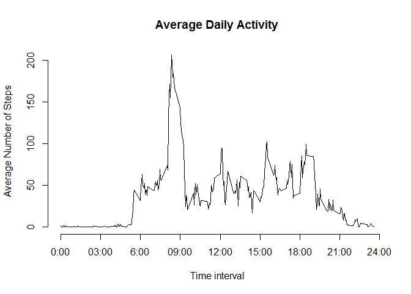
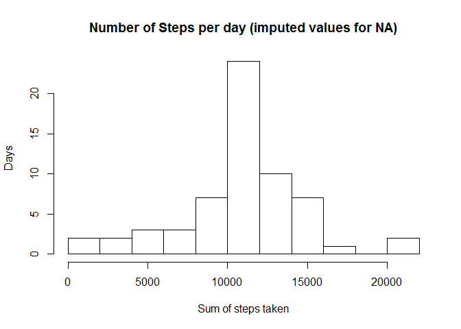
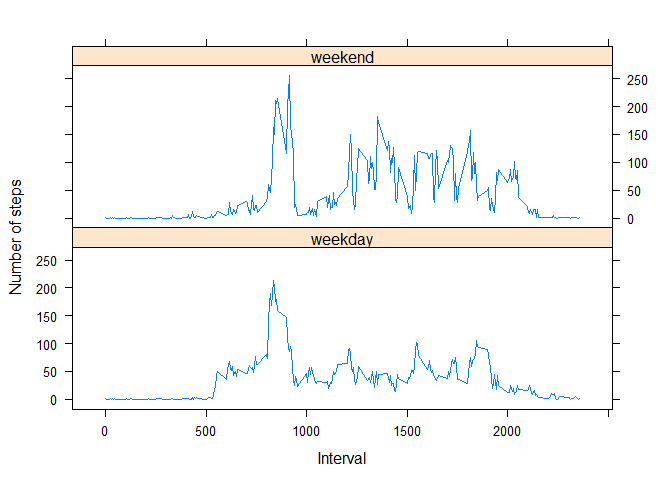

# Coursera Reproducible Research - Course project 1


## 1. Code for reading in the dataset and/or processing the data

The following code assumes that the zipped dataset is available in a "data" subfolder of the current working directory. The data is read to two data frames with and without NA values.


```r
unzip(zipfile = "./data/repdata_data_activity.zip", files = "activity.csv", exdir = "./data")
activity <- read.csv("./data/activity.csv")

# remove NA
actNaOmit <- na.omit(activity)
```


## 2. Histogram of the total number of steps taken each day

The histogram is created on the data without NAs.


```r
stepsPerDay <- aggregate(actNaOmit$steps, list(actNaOmit$date), sum)
colnames(stepsPerDay) <- c("date", "steps")
hist(stepsPerDay$steps, breaks = 15, main="Number of Steps per day", 
     xlab="Sum of steps taken", ylab = "Days")
```

<!-- -->


## 3. Mean and median number of steps taken each day

Mean of number of steps:


```r
mean1 <- mean(stepsPerDay$steps, na.rm = TRUE)
mean1
```

```
## [1] 10766.19
```

Median of number of steps:


```r
median1 <- median(stepsPerDay$steps, na.rm = TRUE)
median1
```

```
## [1] 10765
```

General summary:


```r
summary(stepsPerDay$steps)
```

```
##    Min. 1st Qu.  Median    Mean 3rd Qu.    Max. 
##      41    8841   10760   10770   13290   21190
```


## 4. Time series plot of the average number of steps taken

```r
# caluclate avg steps per interval
avgInt <- aggregate(actNaOmit$steps, list(actNaOmit$interval), mean)
colnames(avgInt) <- c("Interval", "AvgNumSteps")

# plot time series
plot(avgInt$Interval, avgInt$AvgNumSteps,axes = F, type="l", xlab="Time interval", ylab="Average Number of Steps", main="Average Daily Activity")
axis(1,at=c(0,300, 600, 900, 1200, 1500, 1800, 2100, 2400), label = c("0:00", "03:00", "6:00", "09:00","12:00","15:00", "18:00", "21:00","24:00"))
axis(2)
```

<!-- -->

## 5. The 5-minute interval that, on average, contains the maximum number of steps

The interval with the average number of steps is:


```r
avgInt[which.max(avgInt$AvgNumSteps),]
```

```
##     Interval AvgNumSteps
## 104      835    206.1698
```

It is the interval from 08:35-08:40.


## 6. Code to describe and show a strategy for imputing missing data

Chosen approach: Fill in missing values with the average for the time intervals


```r
imputedData <- activity

# function to impute if necessary
impute <- function (a, a.impute){
  ifelse (is.na(a), a.impute, a)
}

# tmp vector
avg1 <- vector(mode="numeric", length=0)

# get average value
for (i in 1:nrow(activity)){
    if (is.na(activity$steps[i])){
        avg1[i] <- avgInt$AvgNumSteps[which(activity$interval[i] == avgInt$Interval)]
    }
    else {
      avg1[i] <- activity$steps[i]
    }   
}

# impute values
imputedData$steps <- impute (activity$steps, avg1)
```


## 7. Histogram of the total number of steps taken each day after missing values are imputed

Create new histogram


```r
stepsPerDay <- aggregate(imputedData$steps, list(imputedData$date), sum)
colnames(stepsPerDay) <- c("date", "steps")
hist(stepsPerDay$steps, breaks = 15, main="Number of Steps per day (imputed values for NA)", 
     xlab="Sum of steps taken", ylab = "Days")
```

<!-- -->

Mean of number of steps:


```r
mean2 <- mean(stepsPerDay$steps, na.rm = TRUE)
mean2
```

```
## [1] 10766.19
```

Median of number of steps:


```r
median2 <- median(stepsPerDay$steps, na.rm = TRUE)
median2
```

```
## [1] 10766.19
```

Differences between imputed and orignal data:

```r
mean1-mean2
```

```
## [1] 0
```

```r
median1-median2
```

```
## [1] -1.188679
```

Result:
While the overall mean stayed the same - the median shifted.


## 8. Panel plot comparing the average number of steps taken per 5-minute interval across weekdays and weekends

Identify day of week, daytype (weekday, weekend) and calculate average for these groups.


```r
# get day of week
imputedData$weekdays <- as.POSIXlt(as.Date(imputedData$date))$wday
# define weekend or not
imputedData$daytype <- ifelse(imputedData$weekdays %in% c(6, 7),"weekend", "weekday")

# compute avg per interval and day type
stepsPerDay <- aggregate(imputedData$steps, list(imputedData$interval, imputedData$daytype), mean)
colnames(stepsPerDay) <- c("interval", "daytype", "avgsteps")
```


Now plot the steps using the lattice package


```r
library(lattice)
xyplot(avgsteps ~ interval | daytype, data = stepsPerDay, layout = c(1, 2), 
       type="l", xlab = "Interval", ylab = "Number of steps")
```

<!-- -->

